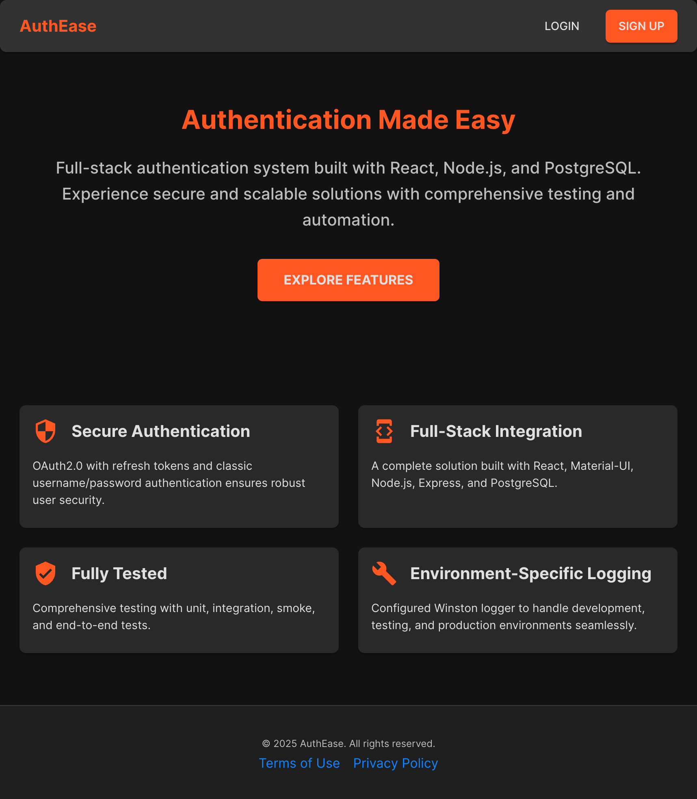
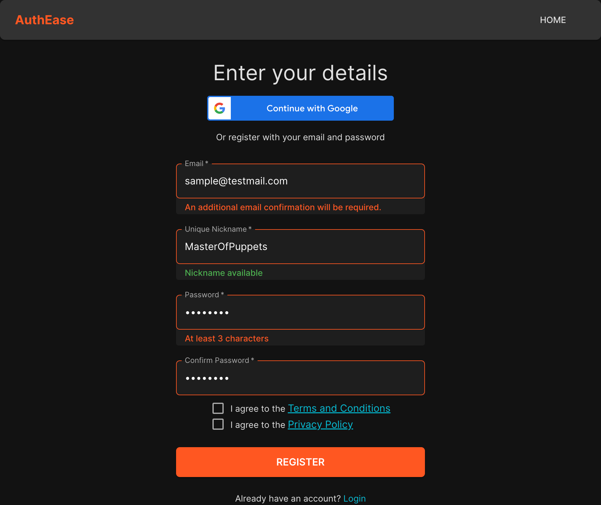
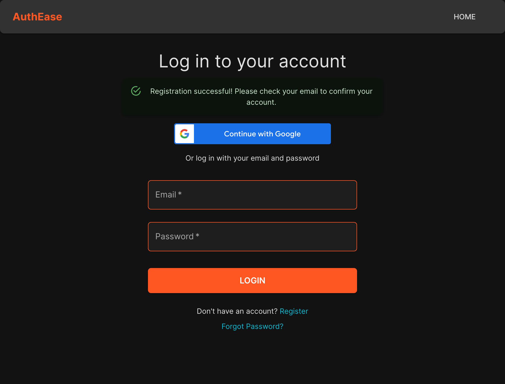
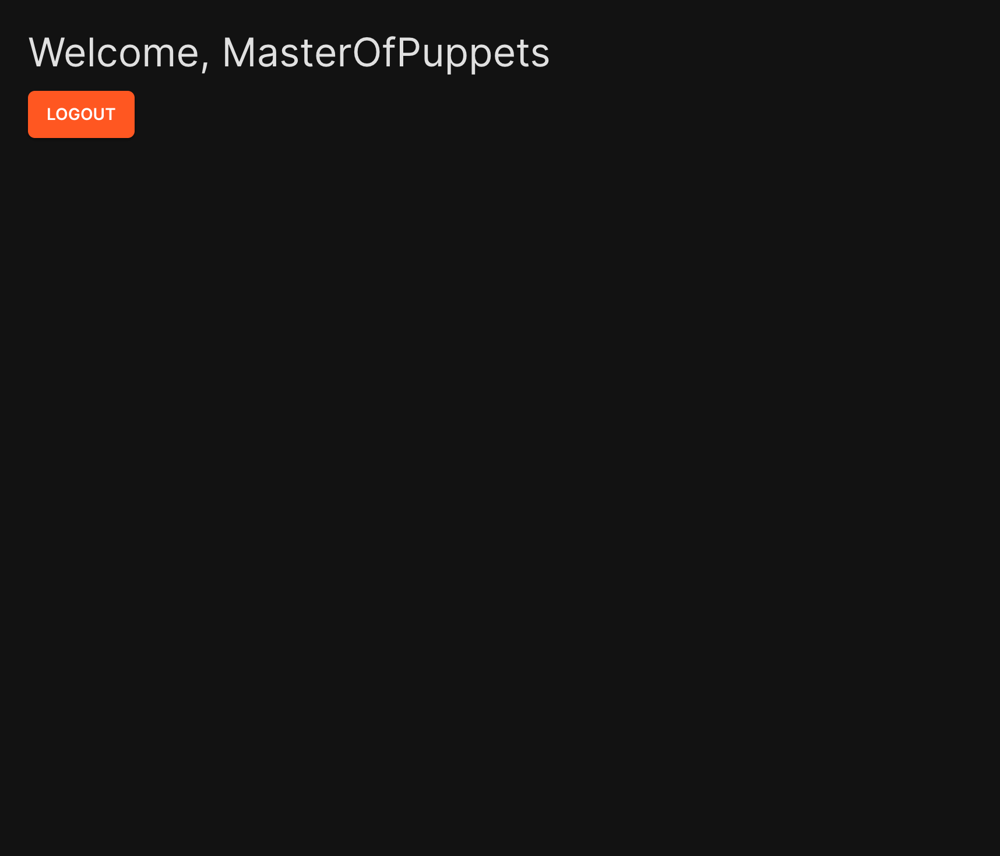

# auth-flow-fullstack

## Overview

This project demonstrates a full-stack implementation of user registration and login functionality, incorporating both:

1. **Google OAuth2 Authentication**
   - Users can log in using their Google account via a dedicated button.

2. **Email and Password Authentication**
   - Supports account registration with email confirmation via a link.
   - Includes a password recovery flow for users who forget their password.

3. **Policy Versioning**
   - Dynamically loads the latest versions of Terms and Conditions or Privacy Policies.
   - Policy content is securely stored on the backend, allowing centralized updates and version control.

The project is split into two independent parts:

- **Frontend**: A React application using Material-UI (MUI).
- **Backend**: A Node.js application using Express, Knex, and PostgreSQL.

Each part is a standalone project with its own dependencies, scripts, and can be separated into individual repositories if needed.


---

## Features

### Frontend
- Built with React and Material-UI for a modern and responsive UI.
- Configurable via `.env` file for flexibility.

### Backend
- Built with Node.js, Express, Knex, and PostgreSQL.
- Secure communication with the frontend using **JWT tokens**.
  - Supports **automatic token refresh** using refresh tokens.
- Configuration via `.env` files for **development**, **test**, and **production** environments.
- Database setup with migration and seed scripts for creating tables and initial data population.
- Comprehensive testing:
  - **Unit**, **integration**, and **smoke tests** using Jest and Supertest.
  - **End-to-end (E2E)** tests using Cypress.
- **Logging**:
  - Implemented using **Winston**, with different log levels and structured JSON logs.
  - Configured for environment-specific needs:
    - Verbose logging in development.
    - Minimal and structured logging in production for performance and monitoring.
    - Debugging logs enabled for testing.
- **Policy Versioning**:
  - The application dynamically loads the latest versions of Terms and Conditions or Privacy Policies.
  - Policy content is securely stored on the backend, enabling centralized updates and version control.

   
## Screenshots

### Landing Page


### Register Page


### Login Page


### Dashboard


#### Logging

The logging system in this project is implemented using **Winston**, providing robust and environment-specific logging. The configuration ensures clear and structured logs during development and efficient file-based logging in production.

##### Key Features

###### 1. Environment-Specific Logging
- **Development:**
  - Logs are displayed on the console with colorized output for easy readability.
  - Log level is set to `debug` to provide detailed information for developers.
- **Production:**
  - Logs are written to files with **daily rotation**, ensuring older logs are archived automatically.
  - Log level is set to `info` for concise and relevant information.
  - Unhandled exceptions are logged separately for monitoring and debugging.

###### 2. Console Logging
- **Colorized Output:** Logs appear in different colors based on their level (e.g., `info`, `error`, `warn`), improving readability.
- **Testing Mode:** Logs are suppressed during tests if the `TEST_LOGS_SILENT` environment variable is set to `true`.

###### 3. File Logging (Production Only)
- Logs are stored in the `logs` directory with daily rotation:
  - **Filename Pattern:** Logs are named using a date pattern (`%DATE%-combined.log`).
  - **File Size Limit:** Each log file is limited to 20 MB.
  - **Retention Policy:** Logs are retained for 14 days by default.
- Unhandled exceptions are logged in separate files (`%DATE%-exceptions.log`) for better debugging.

###### 4. Configuration
The following environment variables control the logging behavior:

| Variable                 | Description                                                                 | Default Value          |
|--------------------------|-----------------------------------------------------------------------------|------------------------|
| `NODE_ENV`               | Defines the environment (`development`, `test`, `production`).              | `development`          |
| `TEST_LOGS_SILENT`       | Suppresses logs during tests when set to `true`.                            | `false`                |
| `LOG_MAX_SIZE` (TODO)    | Maximum size for log files (e.g., `20m` for 20 MB).                         | `20m`                  |
| `LOG_MAX_DAYS` (TODO)    | Retention period for log files (e.g., `14d` for 14 days).                   | `14d`                  |


### Security
- Secure communication between client and server using **JWT-based authentication**.
- Refresh tokens ensure session longevity without compromising security.

### Portability
- The repository does not include deployment configurations (e.g., GitHub Actions).
- Easily deployable locally with appropriate `.env` files and PostgreSQL setup.

---

## Prerequisites

- **Node.js**: v20.15.1
- **npm**: v10.7.0
- **PostgreSQL**: Ensure the database server is running and configured.

  1. **Create a Database and User**:
     - Access your PostgreSQL server using a client (e.g., `psql` or a GUI like pgAdmin).
     - Run the following commands to create a database and user with the necessary permissions:
       ```sql
       -- Create a new database
       CREATE DATABASE auth_flow_db;

       -- Create a user with a password
       CREATE USER auth_flow_user WITH PASSWORD 'your_password';

       -- Grant privileges to the user on the database
       GRANT ALL PRIVILEGES ON DATABASE auth_flow_db TO auth_flow_user;
       ```
     - Replace `auth_flow_db`, `auth_flow_user`, and `your_password` with your desired database name, username, and password.

  2. **Configure the Backend**:
     - Ensure the database name, username, and password match the configuration in the backend's `.env.development`, `.env.test` and `.env.production` file:
       ```env
       DB_HOST=localhost
       DB_PORT=5432
       DB_NAME=auth_flow_db
       DB_USER=auth_flow_user
       DB_PASSWORD=your_password
       ```
     - Update these values in the `.env` file for each environment (e.g., `development`, `test`, `production`).
- **Set Up SMTP Server**:
   - To enable email-based features such as registration confirmation and password reset, configure SMTP credentials in the backend's `.env.xxx` files:
      ```env
      SMTP_SERVER=smtp.gmail.com
      SMTP_PORT=587
      SMTP_SECURE=false # Use true for port 465 (SSL) or false for STARTTLS
      SMTP_USER=your_email@gmail.com
      SMTP_USER_PASSWORD=your_email_password
      EMAIL_FROM=your_email@gmail.com
      EMAIL_NO_REPLY=noreply@yourdomain.com
      ```
   - **Important Notes**:
      - Replace `your_email@gmail.com` and `your_email_password` with your actual email credentials.
      - For Gmail, ensure you enable "App Passwords" or "Less Secure App Access" in your account settings to use these credentials securely.
      - Adjust `EMAIL_NO_REPLY` to specify the sender for no-reply emails.

More on Server configuration will be explained below. 

---

## Setup Instructions

### 1. Clone the Repository
```bash
git clone <repository-url>
cd auth-flow-fullstack
```

### 2. Backend Setup

1. Navigate to the `backend` folder:
   ```bash
   cd backend
   ```

2. Install dependencies:
   ```bash
   npm install
   ```

#### Configure Environment Variables

Create `.env.development`, `.env.test`, and `.env.production` files as needed in the `backend` directory. These files store configuration values for different environments. Below is a detailed explanation of the environment variables used in the project, along with examples:

##### Database Configuration

| Variable         | Description                                                                 | Example Value       |
|-------------------|-----------------------------------------------------------------------------|---------------------|
| `DB_HOST`         | Host address of the PostgreSQL server.                                      | `127.0.0.1`         |
| `DB_USER`         | PostgreSQL username with access to the database.                           | `auth_flow_user`    |
| `DB_NAME`         | Name of the database used by the application.                              | `auth_flow_db`      |
| `DB_PASSWORD`     | Password for the PostgreSQL user.                                           | `your_password`     |
| `DB_PORT`         | Port number PostgreSQL is running on.                                       | `5432`              |

Example for `.env.development`:
```env
DB_HOST='127.0.0.1'
DB_USER='local'
DB_NAME='auth_flow_db'
DB_PASSWORD='123'
DB_PORT=5432
```

##### Application Ports

| Variable         | Description                                                                 | Example Value       |
|-------------------|-----------------------------------------------------------------------------|---------------------|
| `CLIENT_PORT`         | Port the frontend runs on.                                       | `3000`              |
| `PORT`         | Port the backend runs on.                                       | `3001`              |

Example for `.env.development`:
```env
CLIENT_PORT=3000
PORT=3001
```

##### Authentication

| Variable         | Description                                                                 | Example Value       |
|-------------------|-----------------------------------------------------------------------------|---------------------|
| `GOOGLE_CLIENT_ID`         | Google OAuth2 client ID for authentication.on.                                       | `...`              |
| `ACCESS_TOKEN_EXPIRATION_TIME`         | Expiration time for access tokens (e.g., 15m for 15 minutes).                                       | `15m`              |
| `REFRESH_TOKEN_EXPIRATION_TIME`         |Expiration time for refresh tokens (e.g., 7d for 7 days).                                       | `7d`              |
| `JWT_SECRET`         | Secret key for signing JSON Web Tokens. Generate using a secure method like `openssl rand -hex 64`. (JWT).                                       | `...`              |
| `JWT_REFRESH_SECRET`         | Secret key for signing refresh. Generate using a secure method like `openssl rand -hex 64`. tokens.                                       | `...`              |


Example for `.env.development`:
```env
GOOGLE_CLIENT_ID="..."
ACCESS_TOKEN_EXPIRATION_TIME="15m"
REFRESH_TOKEN_EXPIRATION_TIME="7d"
JWT_SECRET="e77a73dc1ce..."
JWT_REFRESH_SECRET="f77bc80237..."
```

##### Email Configuration

| Variable         | Description                                                                 | Example Value       |
|-------------------|-----------------------------------------------------------------------------|---------------------|
| `SMTP_SERVER`         | SMTP server address used to send emails.on.                                       | `smtp.gmail.com`              |
| `SMTP_PORT`         | Port for the SMTP server.                                       | `587`              |
| `SMTP_SECURE`         |Whether to use secure connection (true/false).                                       | `false`              |
| `SMTP_USER`         | Email address used for SMTP authentication.                                       | `authflow@example.com`              |
| `SMTP_USER_PASSWORD`         | Password for the SMTP user. tokens.                                       | `your_password`              |
| `EMAIL_FROM`         | Default sender email address.                                      | `authflow@example.com`              |
| `EMAIL_NO_REPLY`         | "No Reply" email address for notifications.                                      | `noreply@authflow.com`              | 


Example for `.env.development`:
```env
SMTP_SERVER="smtp.gmail.com"
SMTP_PORT=587
SMTP_SECURE=false
SMTP_USER="authflow@example.com"
SMTP_USER_PASSWORD="your_password"
EMAIL_FROM="authflow@example.com"
EMAIL_NO_REPLY="noreply@authflow.com"
```

##### Miscellaneous

| Variable         | Description                                                                 | Example Value       |
|-------------------|-----------------------------------------------------------------------------|---------------------|
| `BASE_URL`         | Base URL for the backend server. Is used when generating password reset link.                            | `http://localhost:3001`              |
| `PASSWORD_COMPLEXITY`         | Defines the complexity requirements for passwords.                                   | `"simple" or "complex"`              |


Example for `.env.development`:
```env
BASE_URL="http://localhost:3001"
PASSWORD_COMPLEXITY="complex"
``

4. Set up the database:
   - Run migrations to create tables:
     ```bash
     npm run migrate
     ```
   - Seed initial data:
     ```bash
     npm run seed
     ```

5. Start the backend server in development:
   ```bash
   npm run dev
   ```

### 3. Frontend Setup

1. Navigate to the `frontend` folder:
   ```bash
   cd frontend
   ```

2. Install dependencies:
   ```bash
   npm install
   ```

3. Configure environment variables:
   - Create a `.env` file in the `frontend` folder and populate it with the required variables as shown below:

    ```env
    # The port the Frontend runs on, e.g., 3000
    PORT=3000
    
    # The API base URL, e.g., http://localhost:3017
    REACT_APP_API_URL=http://localhost:3017
    
    # Google Client ID for OAuth2 configuration (check your Google Cloud Console for this)
    REACT_APP_GOOGLE_CLIENT_ID=...
    
    # Password complexity setting: can be "simple" (only length checked, minimum 3 characters) or "complex" (includes uppercase, number, and special character requirements)
    REACT_APP_PASSWORD_COMPLEXITY=simple
    ```

   - Ensure that the `REACT_APP_API_URL` points to the backend server's base URL.
   - For testing purposes, you can use `REACT_APP_PASSWORD_COMPLEXITY=simple` for minimal requirements.

4. Start the development server:
   ```bash
   npm run start-dev
   ```

---

## Testing

### Backend Tests
- **Unit, Integration, and Smoke Tests**:
  ```bash
  npm run test
  ```
- **End-to-End Tests**:
  - Ensure both the backend and the frontend are running.
  - Run Cypress:
    ```bash
    npm run test:e2e
    ```

### Frontend Tests
- [Testing steps for frontend, if applicable, can be added later.]

---

## Notes

- This project was extracted from a larger SaaS application and optimized for demonstration purposes.
- All changes were consolidated into a single commit to simplify the repository structure.

---

## Known Limitations
- Deployment configurations (e.g., CI/CD pipelines) are not included in this repository.
- API documentation is currently missing, which may make understanding the available endpoints less intuitive. This will be addressed in future updates.
- Policy version history is not currently displayed to users. Only the latest version is accessible.

## TODO
- [ ] Add Swagger/OpenAPI-based documentation for all backend endpoints.

---

## License

[MIT License](LICENSE)

---

## Contact

For any questions or feedback, please contact me at [15377528+yermbiz@users.noreply.github.com](mailto:15377528+yermbiz@users.noreply.github.com).
